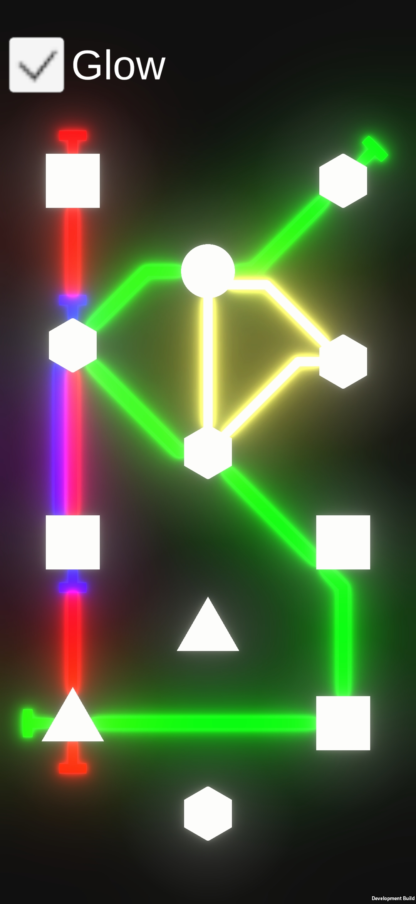
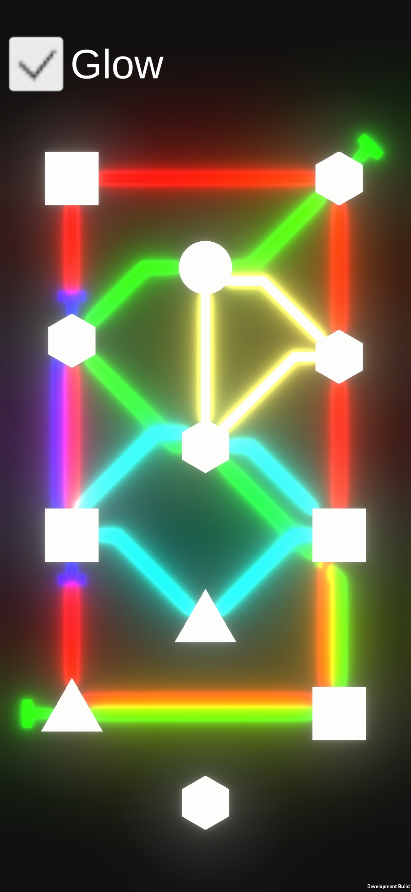
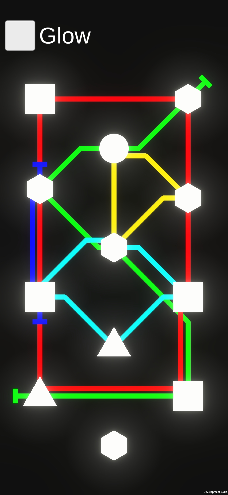
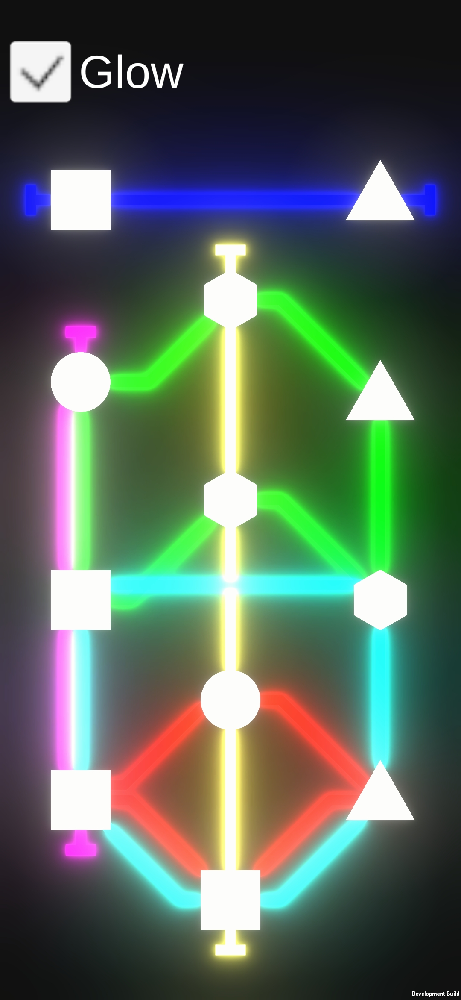
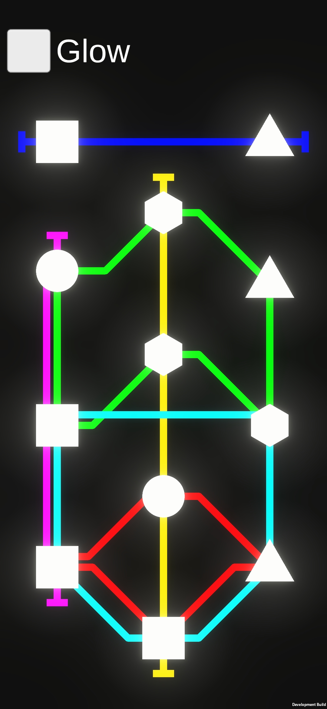

# Dot-Connector
 Dot Connector is a mobile game prototype developed in Unity, inspired by the mechanics of Mini Metro. Players can connect various shapes (stations) using smooth, glowing lines. This project aims to showcase my ability to replicate complex mechanics and write clean, maintainable code.

  
  
  
  
  

